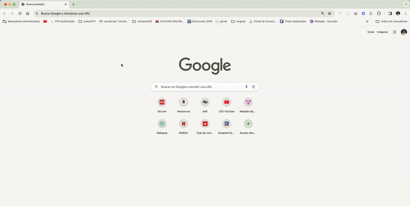
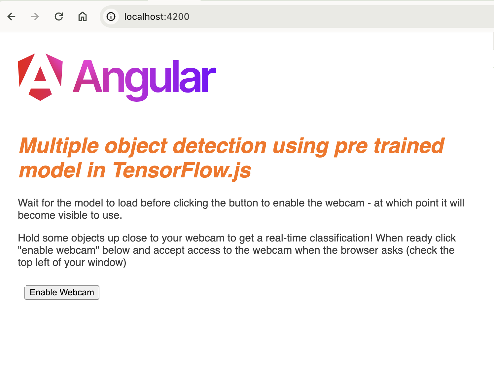
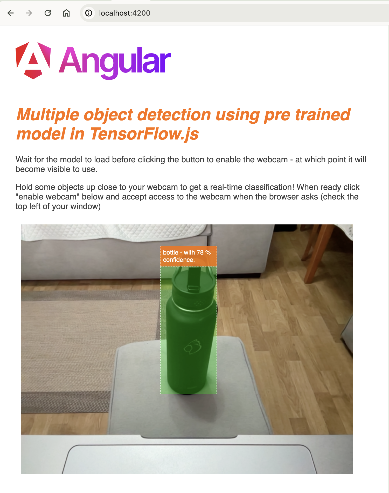
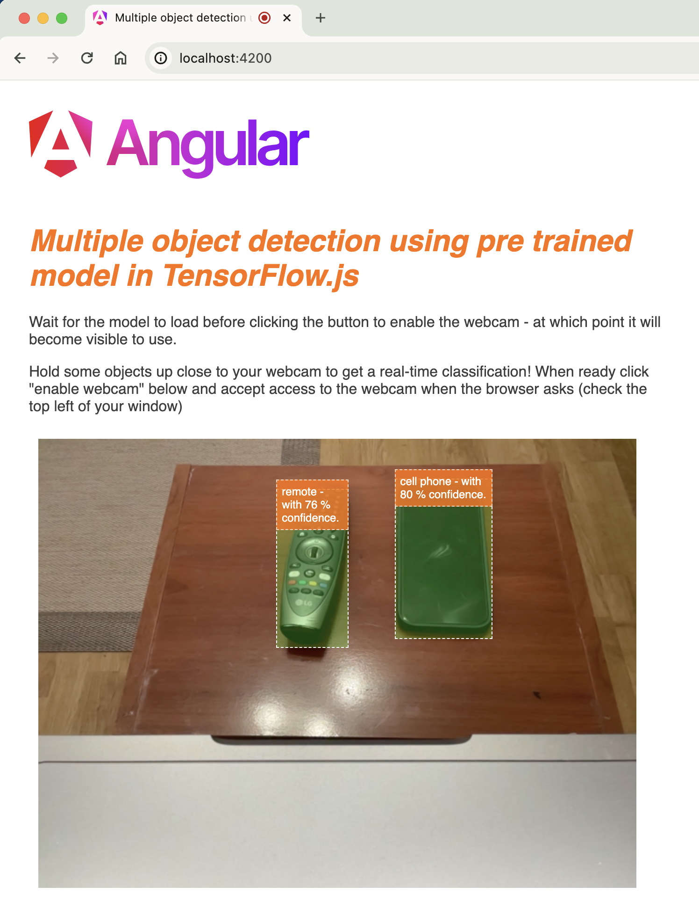
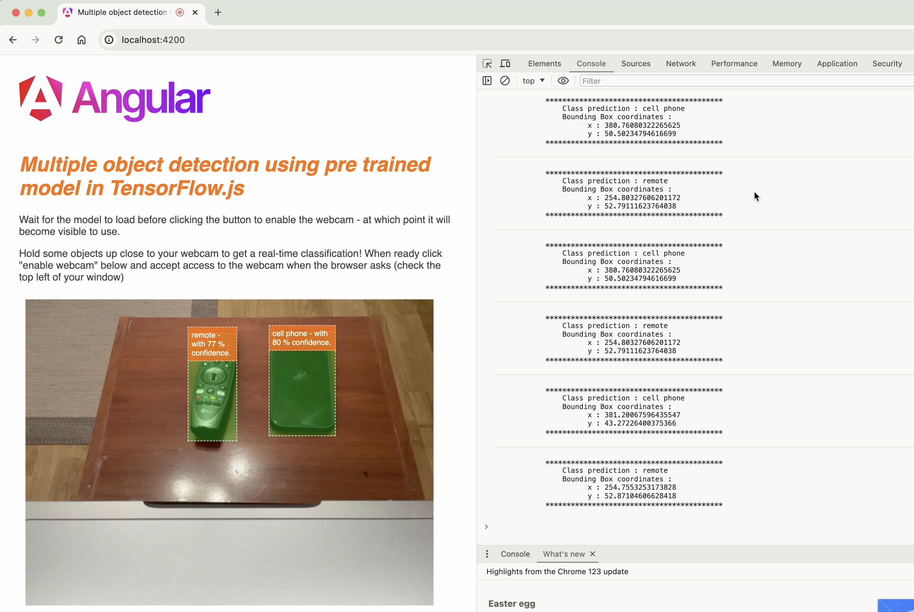

# TfjsCocoSsdWorkspace

This project was generated with [Angular CLI](https://github.com/angular/angular-cli) version 17.3.0.

## Make a smart webcam in JavaScript with a TensorFlow.js pre-trained Machine Learning model

## Development server

Run `ng serve` for a dev server. Navigate to `http://localhost:4200/`. The application will automatically reload if you change any of the source files.

## Code scaffolding

Run `ng generate component component-name` to generate a new component. You can also use `ng generate directive|pipe|service|class|guard|interface|enum|module`.

## Build

Run `ng build` to build the project. The build artifacts will be stored in the `dist/` directory.

## Working App
### Coco SSD angular app

### cocoSsd module loaded

### Bottle identification

### Multiple Objects identification

### Dev tools console bbox coordinates

